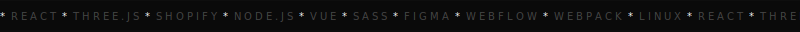

<!--HEADER GLITCH-->


<!--TICKER-->


<br/>

<!--MAIN GRID-->
<table width="100%" cellspacing="0" cellpadding="0" border="0">
<tr>
<td width="38%" valign="top">

<br/>

```js
const sayudha = {
  role  : "Full-Stack Dev",
  studio: "Mazaya Studio",
  focus : [
    "Shopify D2C",
    "Creative Web",
    "3D / Three.js",
    "UI Engineering",
  ],
  status: "open to work",
}
```

<br/>


[sayudha-lukita-wibisana](https://www.linkedin.com/in/sayudha-lukita-wibisana/)


[mazaya.dev@gmail.com](mailto:mazaya.dev@gmail.com)


[mazaya.studio@outlook.com](mailto:mazaya.studio@outlook.com)

</td>
<td width="3%"></td>
<td width="59%" valign="top">

<br/>


</td>
</tr>
</table>

<br/>

<!--STATS-->


<br/>

<!--SKILL BARS-->


<br/>

<!--TECH STACK ICONS-->
<div align="center">


</div>

<br/>

<!--LANGUAGE BREAKDOWN-->

```
— LANGUAGE BREAKDOWN
```

<div align="center">

</div>

<br/>

<!--SNAKE-->

```
— CONTRIBUTION TRAIL
```


<br/>

<!--SPOTIFY-->

```
— NOW PLAYING
```

<div align="center">
<a href="https://open.spotify.com/user/31dp6edlj2uzg7w6uad4n57gfgey">

</a>
</div>

<br/>

<div align="center">


</div>


